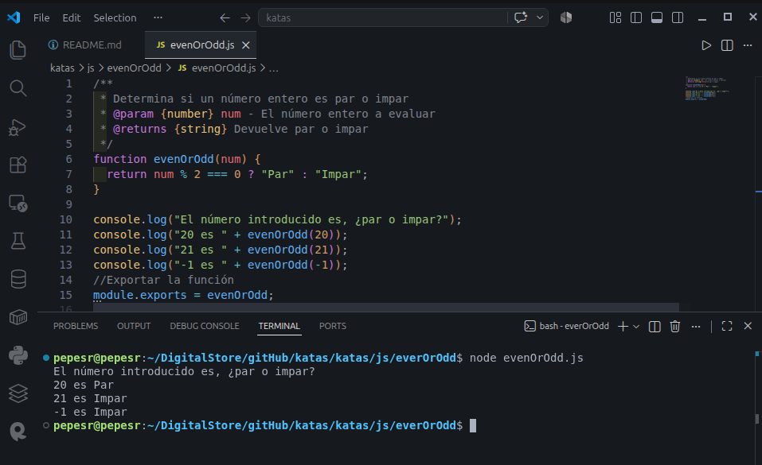

# Even or Odd
Crea una función que recibe un número entero mediante argumento y determina si se trata de un número par o impar.

## Descripción Codewars
Create a function that takes an integer as an argument and returns "Even" for even numbers or "Odd" for odd numbers.

#Mathematics #Fundamentals

# Requisitos previos
Node.js

# Iniciar
Descarga el repositorio:  
`gh repo clone pepesr-dev/katas`  
Entra en la carpeta específica de la app  
`cd katas/katas/js/evenOrOdd`   
Ejecuta la app  
`node evenOrOdd.js`  

# Contribuciones
Esta app no acepta contribuciones.

# Capturas de pantalla
