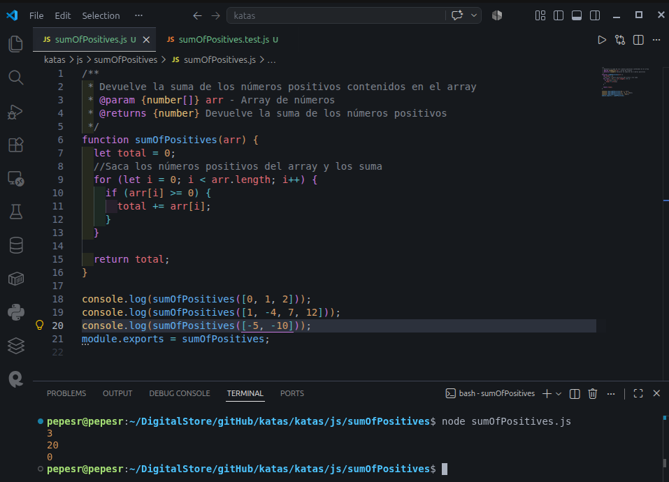

# Sum of positives
Crea una función que reciba un array de números y devuelva la suma de los números positivos.

## Descripción codewars
Task
You get an array of numbers, return the sum of all of the positives ones.

Example
[1, -4, 7, 12] => 
1
+
7
+
12
=
20
1+7+12=20

Note
If there is nothing to sum, the sum is default to 0.

#Arrays #Fundamentals

# Requisitos previos
Node.js

# Iniciar
Descarga el repositorio:  
`gh repo clone pepesr-dev/katas`  
Entra en la carpeta específica de la app  
`cd katas/katas/js/sumOfPositives`   
Ejecuta la app  
`node sumOfPositives.js`  

# Contribuciones
Esta app no acepta contribuciones.

# Capturas de pantalla
